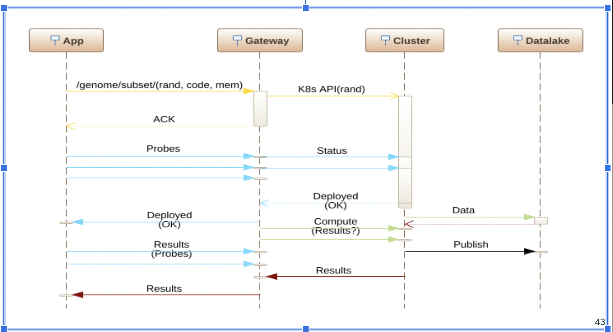

> **_NOTE:_**  This project is a work in progress. The README.md shall be constantly updated to be as comprehensive as possible.

# Description
This project contains a set of scripts to run a Kubernetes cluster with NDN applications. The cluster listens for NDN interests and in turn perform data fetching or computation jobs. The purpose of Kubernetes on the project is to build a scalable NDN testbed that can be used for the purpose of location indepedent content distribution and computing.

# Methodology
We'll setup a Kubernetes cluster with a single node. This node is the gateway to the cluster and will be the only node that can be accessed. This gateway node will run a single NFD which listens for incoming interests.

Upon the cluster setup, following things will have been done:

1. A Kubernetes PVC (Persistent Volume Claim) will be created. This PVC will be mounted to a NFS server which is supposed to be analogous to a remote data lake.

2. Predefined genomics data sets will be downloaded to the data lake with a Kubernetes job.

3. A Kubernetes deployment for gateway shall be running. This deployment will run a single NFD pod acting
as the gateway to the cluster.

4. A Kubernetes deployment for data lake shall be running. This deployment shall run one or more NFDs and file server pods which are attached to PVCs. 

5. The gateway NFD will have prefix registrations for `/ndn/k8s/data` and `/ndn/k8s/compute`. The prefixes will point 
to the data lake NFDs and compute NFDs respectively.

# Interest Types
The incoming interest can have one of the following two prefixes:

1. `/ndn/k8s/data`: This is understood as a request asking for data from the data lake. Upon receiving the 
interest, the gateway NFD will route the request to data lake's NFD. The data lake's NFD will have a complementing
ndn6fileserver running which will serve the data from the PVC. 

2. `/ndn/k8s/compute`: This is understood as a request asking for computing. The interest will first be parsed on the gateway node to understand the computing requirements. The gateway node will then run a Kubernetes job with the specified requirements. The client shall be then able to poll the gateway node for results of the computation.

# Sequence Diagram

